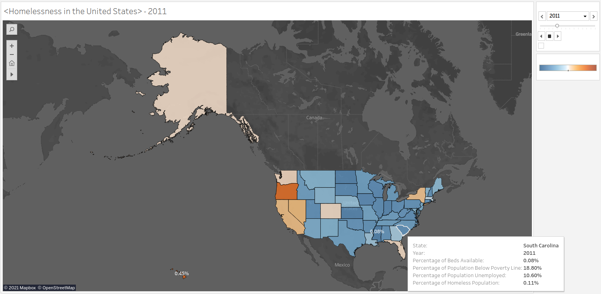
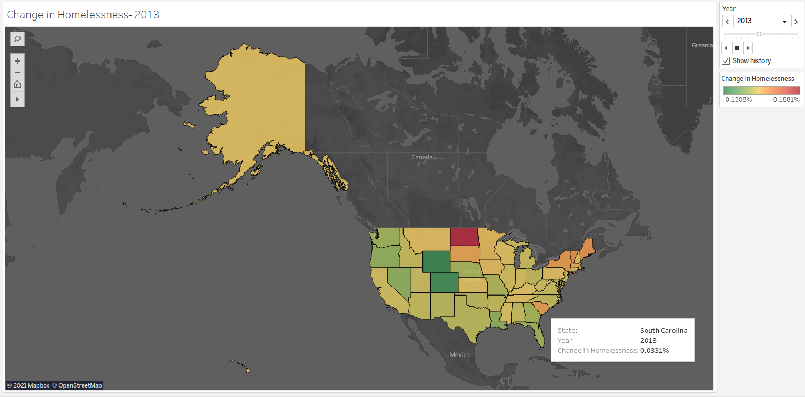

## Analysis of the Homelessness Crisis in the United States

The purpose of this project is to create a proposal for a prospective client group. This proposal will aim to help reduce the homelessness crisis through the power of prediction. Trying to predict the population of homeless people within a state for the upcoming year will allow for better planning and resource allocation. A time-series analysis will be proposed to be created from the available data, spanning from 2007 to 2020 for every state in the United States. 

Above is the initial data visualization using Tableau. The data for the percentage of population of homeless individuals is mapped for each state, for each year in the analysis range. The color gradient signifies the which states have the highest percentage of homeless populations. A screen recording will be made showing the change in homelessness throughout the years. Additional key features have been linked to each state in the detailed information showing: percentage of population below the poverty line, percentage of the population that is unemployed and the percentage of the number of beds available in the population for homeless individuals to utilize.

The above chart shows the change in homelessness from year to year for each state. An increase in homlessness in red and a decrease in homelessness in green.

This data shows how the homeless population changes over time. The data can be used as the starting point for a time-series analysis of homeless population predictions. 
